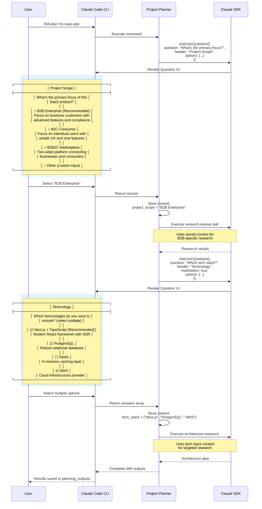

# User Flow and AskUserQuestion UI Interface

## Installation and Usage Flow

```mermaid
flowchart TD
    Start([User starts Claude Code]) --> Install{Plugin<br/>installed?}

    Install -->|No| AddMarketplace[/plugin marketplace add<br/>flight505/flight505-marketplace/]
    AddMarketplace --> InstallPlugin[/plugin install<br/>claude-project-planner@flight505-plugins/]
    InstallPlugin --> Ready[Plugin Ready]

    Install -->|Yes| Ready

    Ready --> Command{User runs<br/>command}

    Command -->|Full Plan| FullPlan[/full-plan project_name/]
    Command -->|Tech Plan| TechPlan[/tech-plan project_name/]
    Command -->|Report| Report[/generate-report/]

    FullPlan --> AskQ1{AskUserQuestion:<br/>Project scope}
    TechPlan --> AskQ1

    AskQ1 --> ShowUI1[Display Question UI<br/>with options]
    ShowUI1 --> UserSelect1[User selects option]
    UserSelect1 --> Phase1[Execute Phase 1:<br/>Market Research]

    Phase1 --> Parallel{--parallel<br/>flag?}

    Parallel -->|Yes| ParallelExec[Run independent tasks<br/>in parallel groups]
    Parallel -->|No| SequentialExec[Run tasks sequentially]

    ParallelExec --> AskQ2{AskUserQuestion:<br/>Tech stack preferences}
    SequentialExec --> AskQ2

    AskQ2 --> ShowUI2[Display Question UI<br/>with tech options]
    ShowUI2 --> UserSelect2[User selects technologies]
    UserSelect2 --> Phase2[Execute Phase 2:<br/>Architecture]

    Phase2 --> Validate{--validate<br/>flag?}

    Validate -->|Yes| MultiModel[Run multi-model<br/>architecture validation]
    Validate -->|No| Continue

    MultiModel --> AskQ3{AskUserQuestion:<br/>Accept validation results?}
    AskQ3 --> ShowUI3[Display Question UI<br/>with Yes/Iterate options]
    ShowUI3 --> UserDecision{User choice}

    UserDecision -->|Iterate| Phase2
    UserDecision -->|Accept| Continue[Continue to Phase 3]

    Continue --> Phase3[Execute Phases 3-5]
    Phase3 --> Complete([Planning Complete])

    Report --> ReportGen[Generate PDF/DOCX/MD<br/>with IEEE citations]
    ReportGen --> Complete

    style AskQ1 fill:#e1f5ff,stroke:#0288d1,stroke-width:2px
    style AskQ2 fill:#e1f5ff,stroke:#0288d1,stroke-width:2px
    style AskQ3 fill:#e1f5ff,stroke:#0288d1,stroke-width:2px
    style ShowUI1 fill:#fff3e0,stroke:#f57c00,stroke-width:2px
    style ShowUI2 fill:#fff3e0,stroke:#f57c00,stroke-width:2px
    style ShowUI3 fill:#fff3e0,stroke:#f57c00,stroke-width:2px
```



## AskUserQuestion UI Interface



## AskUserQuestion Data Structure

### Question Definition (Python SDK)

```python
from claude_sdk import AskUserQuestion

response = client.ask_user_question(
    questions=[
        {
            "question": "What's the primary focus of this SaaS product?",
            "header": "Project Scope",  # Max 12 chars for chip display
            "multiSelect": False,  # Single choice
            "options": [
                {
                    "label": "B2B Enterprise (Recommended)",
                    "description": "Focus on business customers with advanced features and compliance"
                },
                {
                    "label": "B2C Consumer",
                    "description": "Focus on individual users with simple UX and viral features"
                },
                {
                    "label": "B2B2C Marketplace",
                    "description": "Two-sided platform connecting businesses and consumers"
                }
            ]
        }
    ]
)

# Response structure
{
    "answers": {
        "0": "B2B Enterprise (Recommended)"  # Key is question index
    }
}
```

### Multi-Select Example

```python
response = client.ask_user_question(
    questions=[
        {
            "question": "Which features do you want to enable?",
            "header": "Features",
            "multiSelect": True,  # Allow multiple selections
            "options": [
                {"label": "Authentication", "description": "User login and SSO"},
                {"label": "Analytics", "description": "Usage tracking and dashboards"},
                {"label": "API Access", "description": "REST and GraphQL endpoints"},
                {"label": "Webhooks", "description": "Event notifications"}
            ]
        }
    ]
)

# Response structure with multiple selections
{
    "answers": {
        "0": ["Authentication", "Analytics", "API Access"]
    }
}
```

## UI Layout Specification

### Question Card Layout

```
┌─────────────────────────────────────────────────────┐
│ [HEADER CHIP]                                       │ ← 12 char max
├─────────────────────────────────────────────────────┤
│                                                     │
│ [QUESTION TEXT]                                     │ ← Clear question
│                                                     │
│ ○/☐ [OPTION 1 LABEL]                               │ ← Radio/Checkbox
│     [Option 1 Description]                          │ ← Context text
│                                                     │
│ ○/☐ [OPTION 2 LABEL]                               │
│     [Option 2 Description]                          │
│                                                     │
│ ○/☐ [OPTION 3 LABEL]                               │
│     [Option 3 Description]                          │
│                                                     │
│ ○/☐ Other (custom input)                           │ ← Auto-added
│     [Text input field if selected]                  │
│                                                     │
└─────────────────────────────────────────────────────┘
```

### Multi-Question Flow

When asking 2-4 questions sequentially:

1. **Sequential presentation** - One question at a time
2. **Context preservation** - Previous answers available to subsequent questions
3. **Progress indication** - "Question 1 of 3"
4. **Back navigation** - Allow users to revise previous answers

## Best Practices

### When to Use AskUserQuestion

✅ **Good use cases:**
- Technology stack selection (impacts architecture)
- Budget constraints (affects service recommendations)
- Timeline preferences (impacts sprint planning)
- Target audience (B2B vs B2C affects features)
- Deployment preferences (cloud provider selection)

❌ **Avoid for:**
- Implementation details (handle autonomously)
- Minor configuration (use sensible defaults)
- Mid-execution confirmations (unless high-risk)

### Question Design Guidelines

1. **Header**: 12 characters max, describes category
2. **Question**: Clear, specific, ends with "?"
3. **Options**: 2-4 choices, mutually exclusive (unless multiSelect)
4. **Descriptions**: Explain trade-offs and implications
5. **Recommended**: Mark default/preferred option first

### Context Flow

```
User Answer → Store in .context/ → Pass to next skill → Update context → Repeat
```

Each skill receives cumulative context from previous decisions, ensuring coherent planning across all phases.

## Example: Full Planning Session

```bash
$ /full-plan stripe-competitor --parallel

┌─────────────────────────────────────┐
│ Project Scope                       │
├─────────────────────────────────────┤
│ What's the primary use case?        │
│                                     │
│ ○ Payment Processing (Recommended)  │
│ ○ Subscription Management           │
│ ○ Financial Infrastructure          │
└─────────────────────────────────────┘

[User selects "Payment Processing"]

✓ Phase 1: Market Research (running 3 tasks in parallel)
  ├─ research-lookup: Payment processing trends
  ├─ competitive-analysis: Stripe, Square, Adyen
  └─ market-research-reports: Fintech market 2025

┌─────────────────────────────────────┐
│ Technology                          │
├─────────────────────────────────────┤
│ Which payment rails? (multi-select) │
│                                     │
│ ☑ Credit Cards                      │
│ ☑ ACH/Bank Transfers                │
│ ☐ Crypto                            │
│ ☐ Buy Now Pay Later                 │
└─────────────────────────────────────┘

[User selects "Credit Cards" + "ACH"]

✓ Phase 2: Architecture (running 2 tasks in parallel)
  ├─ architecture-research: Payment gateway patterns
  └─ building-blocks: API, processor, reconciliation

┌─────────────────────────────────────┐
│ Validation                          │
├─────────────────────────────────────┤
│ Run multi-model validation?         │
│                                     │
│ ○ Yes - Validate with 3 AI models   │
│ ○ No - Continue to cost analysis    │
└─────────────────────────────────────┘

[User selects "Yes"]

✓ Multi-Model Validation
  ├─ GPT-5: Architecture review (8.5/10)
  ├─ Gemini-2: Security assessment (9/10)
  └─ DeepSeek-R1: Performance analysis (8/10)

✓ Phase 3: Feasibility & Costs
✓ Phase 4: Sprint Planning
✓ Phase 5: Marketing Campaign
✓ Phase 6: Plan Review

📊 Results saved to: planning_outputs/20250112_143022_stripe-competitor/
```

## Integration Points

### With TodoWrite

Questions trigger todo updates:

```python
# Before asking
todos = [
    {"content": "Gather project requirements", "status": "in_progress", "activeForm": "Gathering requirements"}
]

# After user answers
todos = [
    {"content": "Gather project requirements", "status": "completed", "activeForm": "Gathering requirements"},
    {"content": "Execute market research for B2B", "status": "in_progress", "activeForm": "Executing market research"}
]
```

### With Checkpoint/Resume

User answers are persisted in checkpoints:

```json
{
  "phase": 1,
  "completed_tasks": ["research-lookup"],
  "user_context": {
    "project_scope": "B2B Enterprise",
    "tech_stack": ["Next.js", "PostgreSQL", "AWS"],
    "budget_range": "$10k-50k"
  }
}
```

If execution is interrupted, resume from checkpoint with full context.
