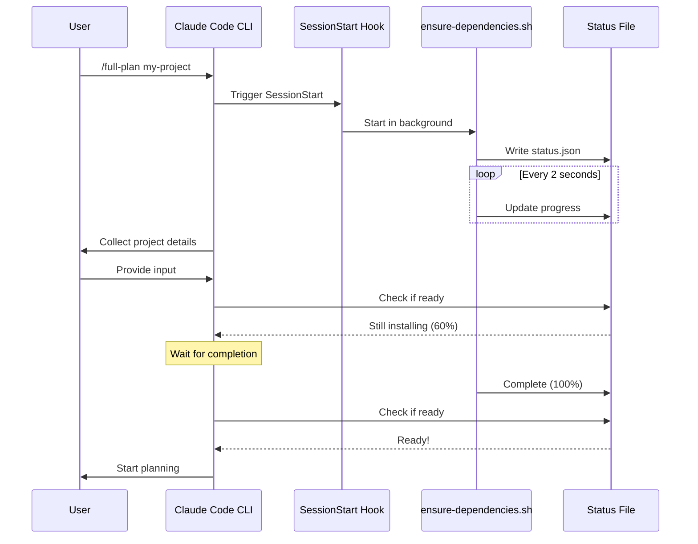

# Dependency Management Guide

This document describes how dependencies are managed in the Claude Project Planner plugin, including automatic installation, fallback mechanisms, and troubleshooting.

## Overview

The plugin uses a smart dependency management system that:

1. **Auto-detects** missing dependencies
2. **Auto-installs** in background during `/full-plan` execution
3. **Tries pip first** (per user preference), then falls back to `uv`
4. **Provides clear status** with progress tracking
5. **Handles failures gracefully** with retry logic

## Dependency Categories

### Core Dependencies (Required)

These are always required for basic planning functionality:

| Package | Purpose | Import Name |
|---------|---------|-------------|
| `python-dotenv` | Environment variable management | `dotenv` |
| `requests` | HTTP requests for API calls | `requests` |
| `pyyaml` | YAML parsing for building blocks | `yaml` |
| `jinja2` | Template rendering | `jinja2` |

### Research Dependencies (Required for `/full-plan`)

Required for market research and competitive analysis:

| Package | Purpose | Import Name |
|---------|---------|-------------|
| `openai` | OpenRouter API client | `openai` |

### Document Processing (Required for document skills)

Required for document conversion and manipulation:

| Package | Purpose | Import Name |
|---------|---------|-------------|
| `markitdown` | Document conversion (PDF, DOCX, PPTX → Markdown) | `markitdown` |
| `pillow` | Image processing | `PIL` |
| `python-pptx` | PowerPoint file handling | `pptx` |

### Google Gemini Integration (Optional)

**Requires Google AI Pro subscription ($19.99/month)**

| Package | Purpose | Import Name |
|---------|---------|-------------|
| `google-genai` | Google Generative AI SDK | `google.genai` |

**Features Enabled:**
- Deep Research (comprehensive multi-step research)
- Veo 3.1 (8-second video generation with audio)
- 1M token context window
- Gemini 2.0 Flash Thinking model

**Cost:** $0.75/second for video generation

### Performance Enhancements (Optional)

| Package | Purpose | Import Name |
|---------|---------|-------------|
| `aiofiles` | Async file I/O | `aiofiles` |
| `httpx` | Async HTTP client | `httpx` |

## Installation Methods

### Automatic Installation (Recommended)

When you run `/full-plan`, dependencies are automatically installed in the background:

```bash
# Just run the command - dependencies install automatically
/full-plan my-project
```

Behind the scenes:
1. `SessionStart` hook triggers background installer
2. Dependencies install while you configure project settings
3. Planning waits for installation to complete before starting
4. Clear error messages if installation fails

### Manual Installation

#### Check Current Status

```bash
# Check what's missing
python scripts/check-dependencies.py

# Check in JSON format
python scripts/check-dependencies.py --json

# Check specific mode
python scripts/check-dependencies.py --mode gemini
```

#### Install Missing Dependencies

```bash
# Install all dependencies for full-plan
pip install -r requirements-full-plan.txt

# Or using uv (faster)
uv pip install -r requirements-full-plan.txt
```

#### Install Individual Packages

```bash
# Example: Install document processing
pip install markitdown pillow python-pptx

# Example: Install Gemini integration
pip install google-genai
```

## Installation Modes

The system supports different installation modes based on your needs:

### Mode: `minimal`

Installs only core dependencies (no research, no documents):

```bash
python scripts/ensure-dependencies.sh minimal
```

**Use when:** Testing core functionality only

### Mode: `full` (Default)

Installs all dependencies except Google Gemini:

```bash
python scripts/ensure-dependencies.sh full
# or just
python scripts/ensure-dependencies.sh
```

**Use when:** Running `/full-plan` with OpenRouter for research

### Mode: `gemini`

Installs all dependencies including Google Gemini:

```bash
python scripts/ensure-dependencies.sh gemini
```

**Use when:** You have Google AI Pro subscription and want Deep Research + Veo 3.1

## Fallback Mechanism

The installer uses a smart fallback system:

```
1. Try pip install
   ↓ (if fails)
2. Try uv pip install
   ↓ (if fails)
3. Mark as failed, continue with other packages
   ↓ (after all packages)
4. Report failures to user
```

### Why pip first?

Based on `CLAUDE.md` user instructions:
> **pip Availability:**
> - Interactive shells: `pip` alias → `uv run pip`
> - Prefer `uv` for project dependencies, but `pip` is available as fallback

The installer respects this preference by trying `pip` first, then falling back to `uv` if needed.

## Background Installation

### How It Works



### Status Tracking

The installer writes real-time status to `/tmp/claude-planner-deps-status.json`:

```json
{
  "status": "installing",
  "progress": 65,
  "current": "markitdown",
  "timestamp": "2026-01-12T14:35:22Z",
  "log_file": "/tmp/claude-planner-deps.log"
}
```

**Status Values:**
- `starting` - Installer initializing
- `installing` - Currently installing packages
- `complete` - All packages installed successfully
- `partial` - Some packages failed
- `timeout` - Installation timed out (> 10 minutes)

### Blocking Before Execution

Before Phase 1 of `/full-plan`, the system waits for dependencies:

```bash
# This runs automatically before planning starts
python scripts/wait-for-dependencies.py
```

**What it does:**
- Polls status file every 2 seconds
- Displays progress bar
- Timeouts after 10 minutes
- Exits with appropriate error code

## Troubleshooting

### Installation Failed

**Symptom:** `wait-for-dependencies.py` exits with error

**Solution:**
1. Check log file:
   ```bash
   cat /tmp/claude-planner-deps.log
   ```

2. Identify failed packages

3. Install manually:
   ```bash
   pip install <failed-package>
   # or
   uv pip install <failed-package>
   ```

4. Re-run `/full-plan`

### Installation Timeout

**Symptom:** Installation takes > 10 minutes

**Possible causes:**
- Slow network connection
- Large packages (e.g., `pillow` with image libs)
- PyPI server issues

**Solution:**
1. Cancel and retry:
   ```bash
   # Kill background installer
   pkill -f ensure-dependencies.sh

   # Re-run
   /full-plan my-project
   ```

2. Or install manually with verbose output:
   ```bash
   pip install -r requirements-full-plan.txt -v
   ```

### Missing uv Command

**Symptom:** `uv: command not found` in logs

**Solution:**

Install `uv`:
```bash
# macOS/Linux
curl -LsSf https://astral.sh/uv/install.sh | sh

# Or with Homebrew
brew install uv

# Or with pip
pip install uv
```

### Permission Errors

**Symptom:** `PermissionError: [Errno 13] Permission denied`

**Solution:**

Use virtual environment or user install:
```bash
# Create virtual environment
python3 -m venv .venv
source .venv/bin/activate

# Install dependencies
pip install -r requirements-full-plan.txt
```

### Google Gemini Not Working

**Symptom:** `Deep Research` or `Veo 3.1` features unavailable

**Checklist:**
- [ ] Do you have Google AI Pro subscription? ($19.99/month)
- [ ] Is `GEMINI_API_KEY` set in `.env`?
- [ ] Is `google-genai` package installed?

**Verify:**
```bash
# Check API key
echo $GEMINI_API_KEY

# Check package
python3 -c "import google.genai; print('✓ google-genai installed')"

# Test authentication
python3 << EOF
from google import genai
client = genai.Client()  # Reads GEMINI_API_KEY from env
print("✓ Authentication successful")
EOF
```

## Version Compatibility

### Python Versions

**Required:** Python 3.10 - 3.12

```bash
# Check your Python version
python3 --version
```

If you have Python 3.9 or older, upgrade:
```bash
# macOS with Homebrew
brew install python@3.12

# Ubuntu/Debian
sudo apt install python3.12
```

### Package Versions

Minimum required versions are specified in `requirements-full-plan.txt`:

| Package | Minimum Version | Reason |
|---------|-----------------|--------|
| `python-dotenv` | >= 1.0.0 | Consistent environment handling |
| `requests` | >= 2.31.0 | Security fixes |
| `pyyaml` | >= 6.0.0 | Full YAML 1.2 support |
| `jinja2` | >= 3.1.0 | Security fixes |
| `openai` | >= 1.0.0 | New API format |
| `markitdown` | >= 0.1.0 | Latest features |
| `pillow` | >= 10.0.0 | Security fixes |
| `python-pptx` | >= 0.6.21 | PowerPoint compatibility |
| `google-genai` | >= 0.1.0 | Latest SDK |

## Best Practices

### 1. Use Virtual Environments

Always use a virtual environment for isolation:

```bash
# Create and activate
python3 -m venv .venv
source .venv/bin/activate  # Linux/macOS
# or
.venv\Scripts\activate  # Windows

# Install dependencies
pip install -r requirements-full-plan.txt
```

### 2. Pin Versions in Production

For reproducible builds, pin exact versions:

```bash
# Generate pinned requirements
pip freeze > requirements-frozen.txt

# Install from frozen
pip install -r requirements-frozen.txt
```

### 3. Keep Dependencies Updated

Regularly update to get security fixes:

```bash
# Update all packages
pip install --upgrade -r requirements-full-plan.txt

# Or with uv (faster)
uv pip install --upgrade -r requirements-full-plan.txt
```

### 4. Verify After Installation

Always verify critical dependencies work:

```bash
# Run dependency check
python scripts/check-dependencies.py

# Or run a quick test
python3 << EOF
import dotenv, requests, yaml, jinja2, openai
print("✓ All core dependencies working")
EOF
```

## CI/CD Integration

### GitHub Actions Example

```yaml
name: Test

on: [push, pull_request]

jobs:
  test:
    runs-on: ubuntu-latest
    steps:
      - uses: actions/checkout@v3

      - name: Set up Python
        uses: actions/setup-python@v4
        with:
          python-version: '3.12'

      - name: Install uv
        run: pip install uv

      - name: Install dependencies
        run: uv pip install -r requirements-full-plan.txt

      - name: Verify installation
        run: python scripts/check-dependencies.py

      - name: Run tests
        run: pytest tests/
```

## Advanced Configuration

### Custom Installation Script

Override default behavior by setting environment variables:

```bash
# Use different status file location
export CLAUDE_PLANNER_STATUS_FILE="/custom/path/status.json"

# Increase timeout
export CLAUDE_PLANNER_TIMEOUT=1200  # 20 minutes

# Run installer
./scripts/ensure-dependencies.sh
```

### Skip Background Installation

If you prefer manual control:

```bash
# Disable SessionStart hook temporarily
export CLAUDE_SKIP_DEPENDENCY_CHECK=1

# Run planning
/full-plan my-project
```

**Note:** You must install dependencies manually before running.

## Getting Help

If you encounter dependency issues:

1. **Check logs:**
   ```bash
   cat /tmp/claude-planner-deps.log
   ```

2. **Run diagnostic:**
   ```bash
   python scripts/check-dependencies.py --json
   ```

3. **Test individual imports:**
   ```bash
   python3 -c "import <package_name>"
   ```

4. **Open an issue:** https://github.com/flight505/claude-project-planner/issues

Include in your issue:
- Python version (`python3 --version`)
- OS and version
- Output of `check-dependencies.py --json`
- Relevant log excerpts
- Steps to reproduce
