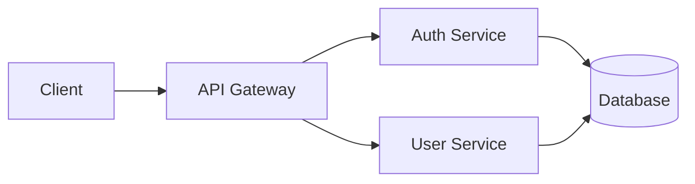
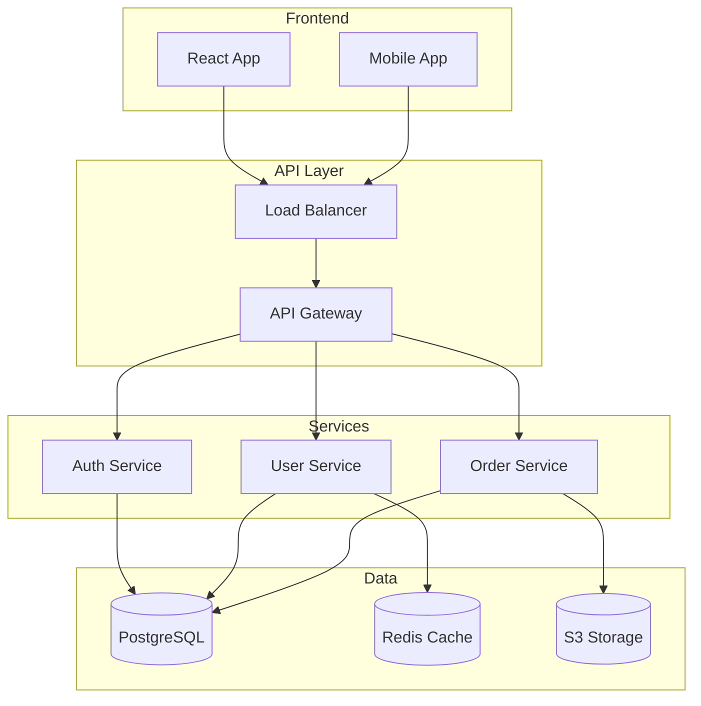
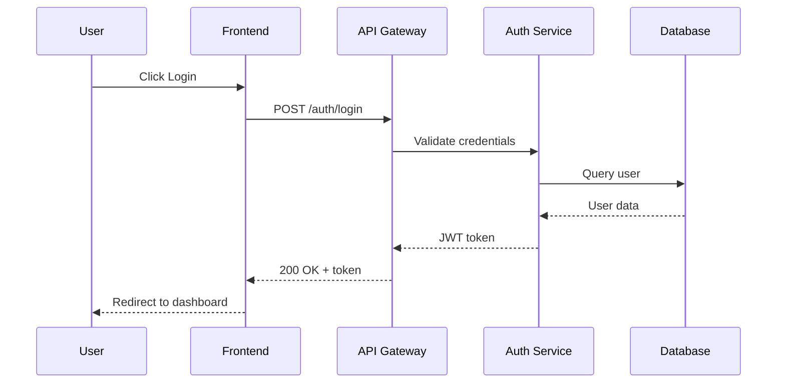
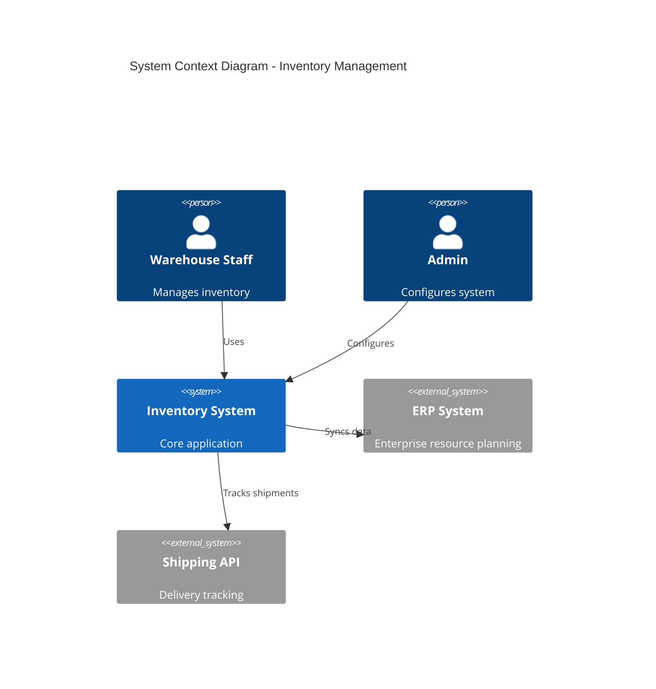
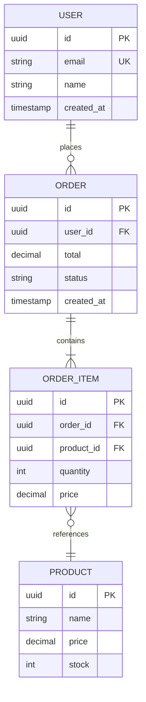
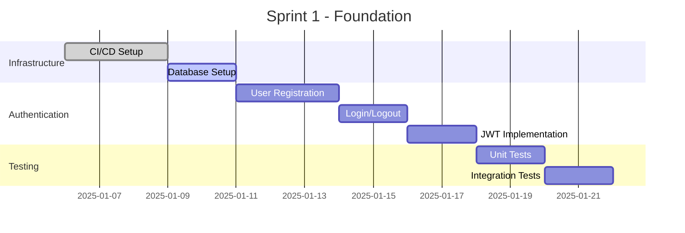
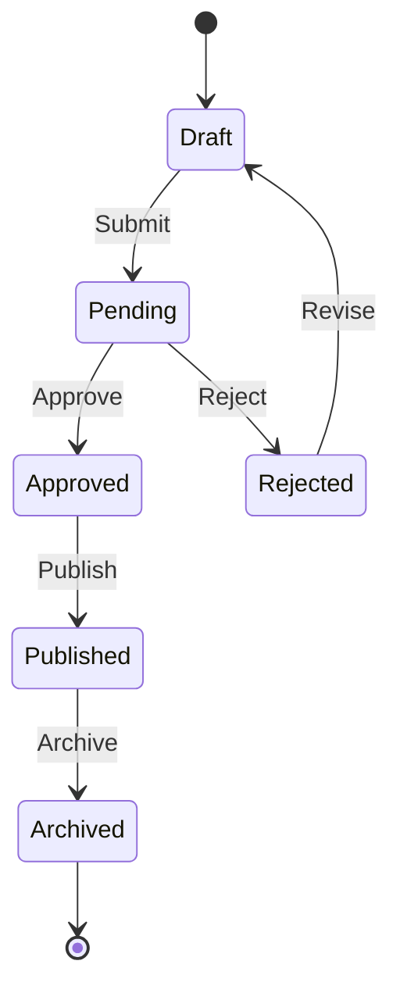
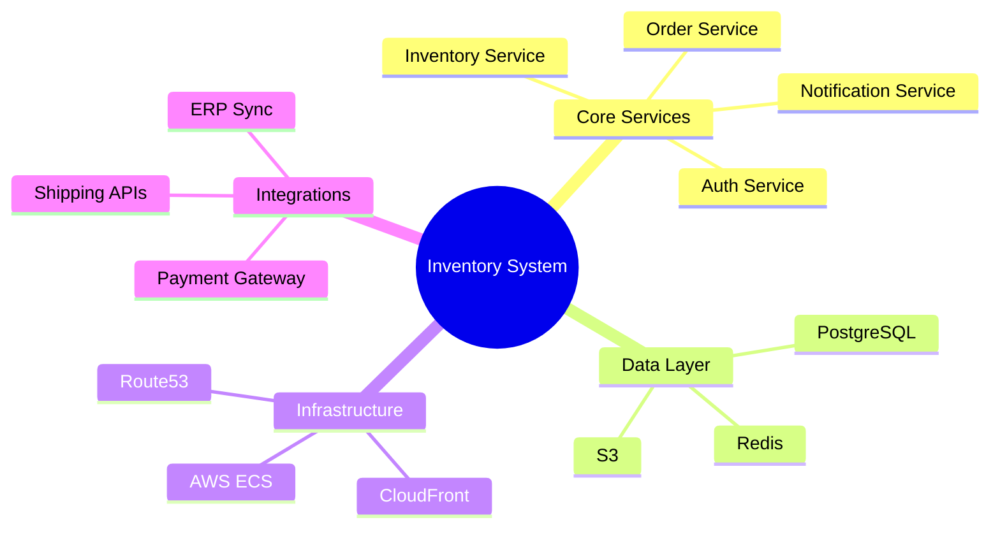
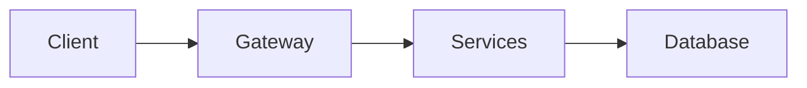
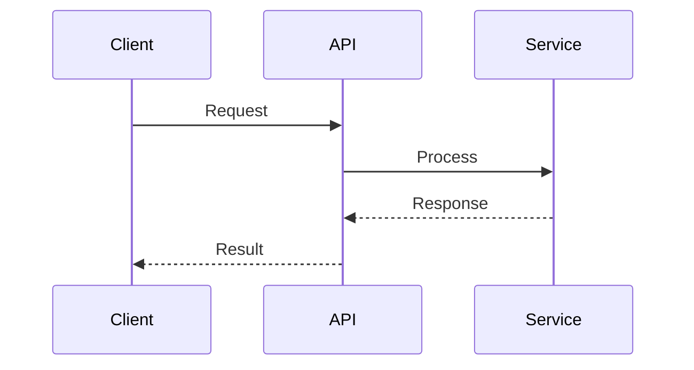

# Project Diagrams and Architecture Visualizations

## Overview

Project diagrams transform complex software architectures and system designs into clear visual representations. **This skill offers two diagram generation approaches:**

| Approach | Best For | Output |
|----------|----------|--------|
| **Nano Banana Pro AI** | Publication-quality visuals, presentations, complex custom diagrams | PNG images |
| **Mermaid** | Version-controlled docs, GitHub markdown, editable diagrams | SVG/PNG from code |

## Choosing Your Approach

### Use Nano Banana Pro AI when:
- You need visually polished, publication-ready diagrams
- Creating custom visualizations that don't fit standard templates
- Diagrams for presentations, proposals, or client deliverables
- Complex architectural diagrams with custom styling

### Use Mermaid when:
- Diagrams need to be version-controlled in git (text diffs)
- Embedding directly in GitHub/GitLab markdown
- You need to edit and iterate quickly on diagram structure
- Standardized diagram types (flowcharts, sequence, C4, ERD, Gantt)
- Collaborative documentation where others may edit

---

## Option 1: Nano Banana Pro AI (Recommended for Visuals)

**This approach uses Nano Banana Pro AI for diagram generation with Gemini 3 Pro quality review.**

**How it works:**
- Describe your diagram in natural language
- Nano Banana Pro generates publication-quality images automatically
- **Gemini 3 Pro reviews quality** against document-type thresholds
- **Smart iteration**: Only regenerates if quality is below threshold
- Professional output in minutes
- No coding, templates, or manual drawing required

**Quality Thresholds by Document Type:**
| Document Type | Threshold | Description |
|---------------|-----------|-------------|
| specification | 8.5/10 | Technical specs, PRDs |
| architecture | 8.0/10 | Architecture documents |
| proposal | 8.0/10 | Business proposals |
| sprint | 7.5/10 | Sprint planning docs |
| presentation | 6.5/10 | Slides, talks |
| default | 7.5/10 | General purpose |

## When to Use This Skill

This skill should be used when:
- Creating system architecture diagrams (C4 model, microservices, etc.)
- Illustrating data flow and integration patterns
- Drawing sequence diagrams for API interactions
- Visualizing database schemas and data models
- Creating deployment architecture diagrams (AWS, GCP, Azure)
- Depicting component relationships and dependencies
- Generating network topologies and infrastructure layouts
- Illustrating CI/CD pipelines and deployment workflows

## Quick Start: Generate Any Diagram

```bash
# System architecture (highest quality: 8.5/10)
python scripts/generate_schematic.py "Microservices architecture with API gateway, auth service, user service, and PostgreSQL" -o diagrams/architecture.png --doc-type specification

# C4 Context diagram
python scripts/generate_schematic.py "C4 Context diagram showing e-commerce system with payment gateway, inventory, customers" -o diagrams/c4_context.png --doc-type architecture

# Sequence diagram
python scripts/generate_schematic.py "Sequence diagram: user authentication flow with client, API, auth service, database" -o diagrams/auth_sequence.png

# Data flow diagram
python scripts/generate_schematic.py "Data flow: user input -> API -> validation -> business logic -> database -> response" -o diagrams/data_flow.png

# AWS deployment
python scripts/generate_schematic.py "AWS deployment: Route53 -> CloudFront -> ALB -> ECS Fargate -> RDS Aurora" -o diagrams/aws_deployment.png
```

## Diagram Types for Project Planning

### 1. System Architecture Diagrams

```bash
python scripts/generate_schematic.py \
  "System architecture for SaaS application: \
   Frontend (React) -> API Gateway -> Microservices (Auth, Users, Payments). \
   Services connect to PostgreSQL and Redis. Event bus (Kafka) for async. \
   Use boxes with different colors for each service layer." \
  -o diagrams/system_architecture.png
```

### 2. C4 Model Diagrams

```bash
# Context Level
python scripts/generate_schematic.py \
  "C4 Context diagram: Central 'Inventory System' box. \
   External actors: Warehouse Staff, Suppliers, Customers. \
   External systems: ERP, Payment Gateway, Shipping. \
   Bidirectional arrows with relationship labels." \
  -o diagrams/c4_context.png

# Container Level
python scripts/generate_schematic.py \
  "C4 Container diagram: Web App (React) -> API Gateway (Kong) -> \
   Microservices: Inventory (Node.js), Orders (Python), Notifications (Go). \
   Databases: PostgreSQL, MongoDB. Message Queue: RabbitMQ." \
  -o diagrams/c4_container.png
```

### 3. Sequence Diagrams

```bash
python scripts/generate_schematic.py \
  "Sequence diagram for checkout: User, Frontend, API, Cart, Payment, Order, Database. \
   Flow: checkout click -> validate cart -> process payment -> create order -> store -> response. \
   Include error path for payment failure." \
  -o diagrams/checkout_sequence.png
```

### 4. Data Model / ERD

```bash
python scripts/generate_schematic.py \
  "ERD for e-commerce: Users has_many Orders has_many OrderItems belongs_to Products. \
   Products belongs_to Categories. Show PKs, FKs, crow's foot notation." \
  -o diagrams/data_model.png
```

### 5. Cloud Infrastructure

```bash
python scripts/generate_schematic.py \
  "AWS architecture: VPC with public/private subnets in 2 AZs. \
   Public: ALB, NAT. Private: ECS Fargate, RDS Aurora. \
   Route53 -> CloudFront -> ALB. CloudWatch monitoring." \
  -o diagrams/aws_infrastructure.png
```

### 6. CI/CD Pipeline

```bash
python scripts/generate_schematic.py \
  "CI/CD pipeline: GitHub push -> Build -> Test -> Security Scan -> \
   Deploy Staging -> Integration Tests -> Approval -> Production. \
   Tools: GitHub Actions, Docker, Jest, Snyk, ArgoCD, K8s." \
  -o diagrams/cicd_pipeline.png
```

## Configuration

```bash
export OPENROUTER_API_KEY='your_api_key_here'
# Get key at: https://openrouter.ai/keys
```

## Prompt Tips

**1. Architecture Style:**
- "Microservices architecture with bounded contexts"
- "Monolithic with layered architecture"
- "Event-driven with CQRS pattern"

**2. Technology Stack:**
- "React frontend, Node.js API, PostgreSQL, Redis"
- "AWS Lambda with API Gateway and SQS"
- "Kubernetes with Istio service mesh"

**3. Relationships:**
- "Synchronous REST calls between services"
- "Async communication via Kafka events"
- "Database replication primary to replicas"

## Integration

Works with other project planning skills:
- **architecture-research** - Diagrams from ADRs
- **building-blocks** - Component visualizations
- **sprint-planning** - Workflow diagrams

## Quick Reference

| Diagram Type | Use Case |
|--------------|----------|
| System Architecture | High-level system overview |
| C4 Context | System boundaries, external interactions |
| C4 Container | Internal services, data stores |
| Sequence | API flows, interactions |
| ERD | Database schema design |
| Deployment | Cloud infrastructure |
| CI/CD Pipeline | Build/deployment workflow |
| Component | Internal service structure |

---

## Option 2: Mermaid (Recommended for Version Control)

Mermaid generates diagrams from text-based code, perfect for documentation that lives in git repositories.

### Quick Start: Inline Mermaid

Embed directly in markdown files:

````markdown

````

### Mermaid Diagram Types for Project Planning

#### 1. System Architecture (Flowchart)



#### 2. Sequence Diagrams



#### 3. C4 Model Diagrams



#### 4. Entity Relationship Diagrams



#### 5. Sprint Timeline (Gantt Chart)



#### 6. State Diagrams (Workflows)



#### 7. Component Diagrams (Mindmap)



### Generating Mermaid to PNG

For documents requiring image files, use the Mermaid CLI:

```bash
# Install mermaid-cli
npm install -g @mermaid-js/mermaid-cli

# Generate PNG from .mmd file
mmdc -i diagram.mmd -o diagrams/output.png -t neutral -b transparent

# Generate SVG (sharper, scalable)
mmdc -i diagram.mmd -o diagrams/output.svg -t neutral

# With custom width
mmdc -i diagram.mmd -o diagrams/output.png -w 1200
```

### Mermaid Themes

```bash
# Available themes: default, neutral, dark, forest
mmdc -i diagram.mmd -o output.png -t forest
```

| Theme | Best For |
|-------|----------|
| `default` | General purpose, blue tones |
| `neutral` | Professional documents, grayscale-friendly |
| `dark` | Dark mode UIs, presentations |
| `forest` | Environmental/green themed projects |

### Mermaid in Project Planning Documents

**Recommended usage in markdown documentation:**

```markdown
## System Architecture

The system follows a microservices architecture:



## API Sequence


```

### When to Use Which

| Scenario | Recommendation |
|----------|----------------|
| Final deliverable PDFs | Nano Banana Pro AI |
| GitHub/GitLab docs | Mermaid (inline) |
| Architecture Decision Records | Mermaid |
| Client presentations | Nano Banana Pro AI |
| Sprint planning docs | Mermaid (Gantt charts) |
| Quick whiteboard-style | Mermaid |
| Complex custom visuals | Nano Banana Pro AI |
| Collaborative editing | Mermaid |

### Mermaid Resources

- **Live Editor**: https://mermaid.live
- **Documentation**: https://mermaid.js.org/
- **GitHub Rendering**: Native support in markdown files
- **VS Code Extension**: "Mermaid Markdown Syntax Highlighting"
